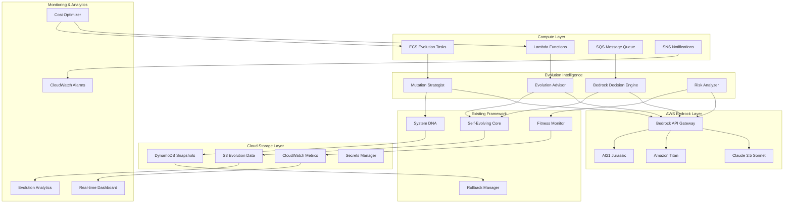

# Design Document: AWS Bedrock AI Evolution System

## Overview

The AWS Bedrock AI Evolution System transforms our existing self-evolving AI framework into a cloud-native, LLM-powered autonomous agent. By integrating AWS Bedrock's advanced language models with scalable cloud infrastructure, we create an intelligent system that can reason about its own evolution, make strategic decisions, and scale dynamically based on demand.

### Key Design Goals
- **LLM-Guided Evolution**: Use Bedrock models for intelligent mutation strategies
- **Cloud-Native Architecture**: Leverage AWS services for scalability and reliability
- **Autonomous Decision Making**: Enable complex reasoning without human intervention
- **Cost-Optimized Operations**: Intelligent resource management and cost controls
- **Enterprise Security**: Implement robust security and compliance measures

## Architecture



## Components and Interfaces

### 1. Evolution Advisor

LLM-powered component that provides strategic guidance for system evolution.

```python
class EvolutionAdvisor:
    """Bedrock-powered evolution strategy advisor"""
    
    def __init__(self, bedrock_client: BedrockClient):
        self.bedrock = bedrock_client
        self.model_router = ModelRouter()
        self.cost_tracker = CostTracker()
        
    async def analyze_system_state(self, dna: SystemDNA, 
                                 fitness_history: List[FitnessScore]) -> EvolutionAnalysis:
        """Analyze current system state using Bedrock LLM"""
        
        # Prepare context for LLM
        context = self._prepare_analysis_context(dna, fitness_history)
        
        # Route to appropriate model based on complexity
        model = self.model_router.select_model(context.complexity)
        
        # Query Bedrock for analysis
        response = await self.bedrock.invoke_model(
            model_id=model,
            prompt=self._build_analysis_prompt(context),
            max_tokens=2000,
            temperature=0.3
        )
        
        return self._parse_analysis_response(response)
    
    async def generate_mutation_strategy(self, analysis: EvolutionAnalysis) -> MutationStrategy:
        """Generate comprehensive mutation strategy using LLM reasoning"""
        
        strategy_prompt = self._build_strategy_prompt(analysis)
        
        response = await self.bedrock.invoke_model(
            model_id="anthropic.claude-3-5-sonnet-20241022-v2:0",
            prompt=strategy_prompt,
            max_tokens=3000,
            temperature=0.4
        )
        
        return self._parse_strategy_response(response)
    
    def _prepare_analysis_context(self, dna: SystemDNA, 
                                fitness_history: List[FitnessScore]) -> AnalysisContext:
        """Prepare structured context for LLM analysis"""
        return AnalysisContext(
            current_generation=dna.generation,
            fitness_score=dna.fitness_score,
            recent_mutations=dna.mutations[-10:],
            fitness_trend=self._calculate_trend(fitness_history),
            performance_metrics=self._extract_metrics(fitness_history),
            complexity=self._assess_complexity(dna, fitness_history)
        )

@dataclass
class EvolutionAnalysis:
    """LLM analysis of system evolution state"""
    current_state_assessment: str
    strengths: List[str]
    weaknesses: List[str]
    opportunities: List[str]
    threats: List[str]
    recommended_focus_areas: List[str]
    confidence_score: float
    reasoning: str

@dataclass
class MutationStrategy:
    """LLM-generated mutation strategy"""
    primary_mutations: List[StrategicMutation]
    contingency_mutations: List[StrategicMutation]
    execution_order: List[str]
    success_criteria: Dict[str, float]
    risk_mitigation: List[str]
    expected_outcomes: Dict[str, str]
    timeline_estimate: str
```

### 2. Bedrock Decision Engine

Advanced decision-making component using LLM reasoning for complex scenarios.

```python
class BedrockDecisionEngine:
    """LLM-powered autonomous decision making"""
    
    def __init__(self, bedrock_client: BedrockClient, config: DecisionConfig):
        self.bedrock = bedrock_client
        self.config = config
        self.decision_history = DecisionHistory()
        
    async def evaluate_high_risk_mutation(self, mutation: Mutation, 
                                        context: SystemContext) -> DecisionResult:
        """Use LLM reasoning to evaluate high-risk mutations"""
        
        decision_prompt = f"""
        You are an expert AI system architect evaluating a high-risk mutation.
        
        SYSTEM CONTEXT:
        - Current Generation: {context.generation}
        - Fitness Score: {context.fitness_score}
        - Recent Performance: {context.recent_performance}
        - System Load: {context.system_load}
        
        PROPOSED MUTATION:
        - Type: {mutation.type}
        - Description: {mutation.description}
        - Fitness Impact: {mutation.fitness_impact}
        - Risk Score: {mutation.risk_score}
        
        DECISION CRITERIA:
        - Risk tolerance: {self.config.risk_tolerance}
        - Performance requirements: {self.config.performance_requirements}
        - Business constraints: {self.config.business_constraints}
        
        Please analyze this mutation and provide:
        1. Detailed risk assessment
        2. Potential benefits and drawbacks
        3. Mitigation strategies
        4. Final recommendation (APPROVE/REJECT/DEFER)
        5. Confidence level (0-100%)
        6. Detailed reasoning
        
        Format your response as structured JSON.
        """
        
        response = await self.bedrock.invoke_model(
            model_id="anthropic.claude-3-5-sonnet-20241022-v2:0",
            prompt=decision_prompt,
            max_tokens=2000,
            temperature=0.2  # Lower temperature for consistent decisions
        )
        
        decision = self._parse_decision_response(response)
        
        # Record decision for learning
        self.decision_history.record(mutation, context, decision)
        
        return decision
    
    async def resolve_system_conflict(self, conflict: SystemConflict) -> ResolutionStrategy:
        """Generate conflict resolution strategy using LLM reasoning"""
        
        resolution_prompt = f"""
        You are resolving a system conflict in an autonomous AI evolution system.
        
        CONFLICT DETAILS:
        - Type: {conflict.type}
        - Description: {conflict.description}
        - Affected Components: {conflict.affected_components}
        - Severity: {conflict.severity}
        - Current Impact: {conflict.current_impact}
        
        SYSTEM STATE:
        - Available Resources: {conflict.available_resources}
        - Active Processes: {conflict.active_processes}
        - Recent Changes: {conflict.recent_changes}
        
        Generate a comprehensive resolution strategy including:
        1. Immediate actions to stabilize the system
        2. Root cause analysis
        3. Long-term prevention measures
        4. Resource requirements
        5. Risk assessment of resolution steps
        6. Success metrics
        
        Prioritize system stability and data integrity.
        """
        
        response = await self.bedrock.invoke_model(
            model_id="anthropic.claude-3-5-sonnet-20241022-v2:0",
            prompt=resolution_prompt,
            max_tokens=2500,
            temperature=0.3
        )
        
        return self._parse_resolution_response(response)

@dataclass
class DecisionResult:
    """LLM decision result with reasoning"""
    recommendation: str  # APPROVE, REJECT, DEFER
    confidence: float
    risk_assessment: Dict[str, float]
    benefits: List[str]
    drawbacks: List[str]
    mitigation_strategies: List[str]
    reasoning: str
    estimated_impact: Dict[str, float]
```

### 3. Cloud DNA Store

AWS-native storage system for evolution data with intelligent tiering.

```python
class CloudDNAStore:
    """AWS-native storage for evolution data"""
    
    def __init__(self, aws_config: AWSConfig):
        self.s3 = boto3.client('s3', region_name=aws_config.region)
        self.dynamodb = boto3.resource('dynamodb', region_name=aws_config.region)
        self.cloudwatch = boto3.client('cloudwatch', region_name=aws_config.region)
        
        self.evolution_bucket = aws_config.evolution_bucket
        self.snapshots_table = self.dynamodb.Table(aws_config.snapshots_table)
        self.metrics_namespace = aws_config.metrics_namespace
        
    async def store_evolution_event(self, event: EvolutionEvent) -> StorageResult:
        """Store evolution event with intelligent tiering"""
        
        # Store detailed data in S3 with lifecycle policies
        s3_key = f"evolution-events/{event.timestamp.year}/{event.timestamp.month}/{event.id}.json"
        
        s3_result = await self._store_to_s3(
            bucket=self.evolution_bucket,
            key=s3_key,
            data=event.to_dict(),
            storage_class='STANDARD_IA' if event.importance < 0.5 else 'STANDARD'
        )
        
        # Store metadata in DynamoDB for fast queries
        dynamo_result = await self._store_to_dynamodb(
            table=self.snapshots_table,
            item={
                'event_id': event.id,
                'timestamp': event.timestamp.isoformat(),
                'type': event.type,
                'generation': event.generation,
                'fitness_delta': event.fitness_delta,
                's3_location': s3_key,
                'ttl': int((event.timestamp + timedelta(days=365)).timestamp())
            }
        )
        
        # Stream metrics to CloudWatch
        await self._send_metrics(event)
        
        return StorageResult(
            s3_success=s3_result.success,
            dynamodb_success=dynamo_result.success,
            storage_location=s3_key
        )
    
    async def create_snapshot(self, dna: SystemDNA, metadata: Dict[str, Any]) -> SnapshotResult:
        """Create versioned snapshot with cross-region replication"""
        
        snapshot_id = f"snap_{datetime.now().strftime('%Y%m%d_%H%M%S_%f')}"
        
        # Store in DynamoDB for fast access
        snapshot_item = {
            'snapshot_id': snapshot_id,
            'timestamp': datetime.now().isoformat(),
            'generation': dna.generation,
            'fitness_score': dna.fitness_score,
            'dna_data': dna.to_dict(),
            'metadata': metadata,
            'checksum': dna.get_checksum(),
            'ttl': int((datetime.now() + timedelta(days=90)).timestamp())
        }
        
        # Store with conditional write to prevent duplicates
        try:
            await self.snapshots_table.put_item(
                Item=snapshot_item,
                ConditionExpression='attribute_not_exists(snapshot_id)'
            )
            
            # Replicate to backup region
            await self._replicate_snapshot(snapshot_item)
            
            return SnapshotResult(
                success=True,
                snapshot_id=snapshot_id,
                storage_location=f"dynamodb://{self.snapshots_table.name}/{snapshot_id}"
            )
            
        except ClientError as e:
            if e.response['Error']['Code'] == 'ConditionalCheckFailedException':
                return SnapshotResult(success=False, error="Snapshot already exists")
            raise
    
    async def query_evolution_history(self, query: EvolutionQuery) -> List[EvolutionEvent]:
        """Query evolution history with intelligent caching"""
        
        # Try DynamoDB first for recent data
        if query.time_range.days <= 30:
            return await self._query_dynamodb(query)
        
        # Use S3 Select for historical data
        return await self._query_s3_select(query)
```

### 4. Model Router

Intelligent routing to appropriate Bedrock models based on task requirements.

```python
class ModelRouter:
    """Intelligent routing to optimal Bedrock models"""
    
    MODELS = {
        'claude-3-5-sonnet': {
            'id': 'anthropic.claude-3-5-sonnet-20241022-v2:0',
            'strengths': ['reasoning', 'code_analysis', 'complex_decisions'],
            'cost_per_1k_tokens': 0.003,
            'max_tokens': 200000,
            'latency_ms': 2000
        },
        'claude-3-haiku': {
            'id': 'anthropic.claude-3-haiku-20240307-v1:0',
            'strengths': ['speed', 'simple_tasks', 'classification'],
            'cost_per_1k_tokens': 0.00025,
            'max_tokens': 200000,
            'latency_ms': 500
        },
        'titan-text': {
            'id': 'amazon.titan-text-premier-v1:0',
            'strengths': ['summarization', 'content_generation'],
            'cost_per_1k_tokens': 0.0005,
            'max_tokens': 32000,
            'latency_ms': 1000
        }
    }
    
    def __init__(self):
        self.performance_tracker = ModelPerformanceTracker()
        self.cost_optimizer = CostOptimizer()
        
    def select_model(self, task: TaskContext) -> str:
        """Select optimal model based on task requirements"""
        
        # Score each model for this task
        scores = {}
        for model_name, model_info in self.MODELS.items():
            score = self._calculate_model_score(model_info, task)
            scores[model_name] = score
        
        # Select highest scoring model
        best_model = max(scores.items(), key=lambda x: x[1])
        
        # Apply cost constraints
        if self.cost_optimizer.should_use_cheaper_model(task):
            return self._select_cost_optimized_model(scores, task)
        
        return self.MODELS[best_model[0]]['id']
    
    def _calculate_model_score(self, model_info: Dict, task: TaskContext) -> float:
        """Calculate model suitability score for task"""
        
        score = 0.0
        
        # Task complexity matching
        if task.complexity == 'high' and 'reasoning' in model_info['strengths']:
            score += 0.4
        elif task.complexity == 'low' and 'speed' in model_info['strengths']:
            score += 0.4
        
        # Performance history
        historical_performance = self.performance_tracker.get_performance(
            model_info['id'], task.type
        )
        score += historical_performance * 0.3
        
        # Latency requirements
        if task.max_latency_ms and model_info['latency_ms'] <= task.max_latency_ms:
            score += 0.2
        
        # Cost efficiency
        cost_efficiency = 1.0 / (model_info['cost_per_1k_tokens'] * task.estimated_tokens)
        score += min(cost_efficiency / 1000, 0.1)  # Normalize cost factor
        
        return score

@dataclass
class TaskContext:
    """Context for model selection"""
    type: str  # 'analysis', 'decision', 'strategy', 'resolution'
    complexity: str  # 'low', 'medium', 'high'
    estimated_tokens: int
    max_latency_ms: Optional[int]
    accuracy_requirements: float  # 0.0 - 1.0
    cost_sensitivity: float  # 0.0 - 1.0
```

## Data Models

### Evolution Event Schema

```json
{
  "id": "evt_20251229_143022_123456",
  "timestamp": "2025-12-29T14:30:22.123456Z",
  "type": "mutation_applied",
  "generation": 15,
  "fitness_delta": 5.2,
  "mutation_id": "mut_20251229_143022_123456",
  "bedrock_analysis": {
    "model_used": "anthropic.claude-3-5-sonnet-20241022-v2:0",
    "confidence": 0.87,
    "reasoning": "This mutation improves communication efficiency...",
    "predicted_impact": 4.8,
    "actual_impact": 5.2
  },
  "system_context": {
    "cpu_usage": 0.65,
    "memory_usage": 0.72,
    "active_processes": 12,
    "recent_errors": 0
  },
  "storage_metadata": {
    "s3_location": "s3://evolution-data/events/2025/12/evt_20251229_143022_123456.json",
    "size_bytes": 2048,
    "storage_class": "STANDARD"
  }
}
```

### Bedrock Decision Schema

```json
{
  "decision_id": "dec_20251229_143022_789012",
  "timestamp": "2025-12-29T14:30:22.789012Z",
  "mutation_id": "mut_20251229_143022_123456",
  "model_used": "anthropic.claude-3-5-sonnet-20241022-v2:0",
  "decision": "APPROVE",
  "confidence": 0.92,
  "risk_assessment": {
    "overall_risk": 0.25,
    "technical_risk": 0.15,
    "business_risk": 0.35,
    "operational_risk": 0.20
  },
  "reasoning": "The proposed mutation shows strong potential for improving system efficiency with manageable risks. The technical implementation is sound and aligns with current system architecture...",
  "mitigation_strategies": [
    "Create snapshot before applying mutation",
    "Monitor fitness metrics for 1 hour post-application",
    "Prepare rollback plan with automated triggers"
  ],
  "estimated_outcomes": {
    "fitness_improvement": "4-6 points",
    "performance_impact": "minimal",
    "stability_risk": "low"
  },
  "cost_analysis": {
    "tokens_used": 1847,
    "cost_usd": 0.005541,
    "processing_time_ms": 2341
  }
}
```

## Correctness Properties

*A property is a characteristic or behavior that should hold true across all valid executions of a system—essentially, a formal statement about what the system should do. Properties serve as the bridge between human-readable specifications and machine-verifiable correctness guarantees.*

### Property 1: Bedrock Response Validation
*For any* Bedrock LLM response, the system SHALL validate the response format, extract structured data successfully, and handle malformed responses gracefully without system failure.
**Validates: Requirements 1.2, 1.4**

### Property 2: Cost Tracking Accuracy
*For any* Bedrock API call, the system SHALL accurately track token usage, calculate costs, and maintain running totals that match AWS billing within 1% accuracy.
**Validates: Requirements 1.5, 8.1**

### Property 3: Model Routing Consistency
*For any* task context, the model router SHALL select the same model for identical contexts and provide deterministic routing based on defined criteria.
**Validates: Requirements 9.1, 9.5**

### Property 4: Cloud Storage Durability
*For any* evolution event stored in AWS, the data SHALL be retrievable with 99.999% durability and maintain referential integrity across S3 and DynamoDB.
**Validates: Requirements 2.1, 2.2**

### Property 5: Decision Audit Trail
*For any* autonomous decision made by the Bedrock Decision Engine, the system SHALL maintain a complete audit trail with LLM reasoning, confidence scores, and outcome tracking.
**Validates: Requirements 3.5, 7.3**

### Property 6: Fallback Mechanism Reliability
*For any* Bedrock service failure, the system SHALL fallback to local decision-making within 5 seconds and continue operations without data loss.
**Validates: Requirements 1.4, 6.4**

### Property 7: Security Compliance
*For any* AWS service interaction, the system SHALL use proper IAM roles, encrypt data in transit and at rest, and maintain audit logs for compliance.
**Validates: Requirements 7.1, 7.2, 7.3**

### Property 8: Cost Budget Enforcement
*For any* period where costs exceed defined budgets, the system SHALL automatically implement cost reduction measures and alert administrators within 1 minute.
**Validates: Requirements 8.4, 8.5**

### Property 9: Real-time Monitoring Accuracy
*For any* system state change, monitoring dashboards SHALL reflect the change within 30 seconds with 100% accuracy of displayed metrics.
**Validates: Requirements 10.1, 10.3**

### Property 10: Multi-Region Consistency
*For any* data replicated across AWS regions, the system SHALL maintain eventual consistency within 60 seconds and handle region failures gracefully.
**Validates: Requirements 2.5, 6.2**

## Error Handling

### Error Categories and Cloud Responses

| Error Type | Immediate Response | Cloud Escalation | Cost Impact |
|------------|-------------------|------------------|-------------|
| Bedrock API Failure | Retry with exponential backoff | Switch to backup model | Low |
| Token Limit Exceeded | Truncate prompt intelligently | Use smaller model | Medium |
| Cost Budget Exceeded | Pause non-critical operations | Alert + auto-optimize | High |
| S3 Storage Failure | Queue for retry | Switch to backup region | Low |
| DynamoDB Throttling | Implement backoff | Auto-scale capacity | Medium |
| IAM Permission Denied | Log security event | Escalate to admin | Critical |

### Cloud-Native Healing Strategies

```python
class CloudHealingStrategies:
    """AWS-native healing strategies"""
    
    STRATEGIES = {
        'bedrock_throttling': [
            'exponential_backoff',
            'model_switching',
            'request_batching',
            'priority_queuing'
        ],
        'cost_overrun': [
            'pause_non_critical',
            'switch_to_cheaper_models',
            'optimize_prompts',
            'implement_caching'
        ],
        'storage_failure': [
            'retry_with_backoff',
            'switch_region',
            'use_backup_storage',
            'queue_operations'
        ],
        'lambda_timeout': [
            'increase_timeout',
            'split_processing',
            'use_ecs_instead',
            'optimize_code'
        ]
    }
    
    async def heal_bedrock_failure(self, error: BedrockError) -> HealingResult:
        """Heal Bedrock-specific failures"""
        
        if error.type == 'throttling':
            # Implement intelligent backoff
            await self._exponential_backoff(error.retry_after)
            
            # Switch to less loaded model
            alternative_model = self.model_router.get_alternative(error.model_id)
            return HealingResult(
                success=True,
                strategy='model_switching',
                new_model=alternative_model
            )
        
        elif error.type == 'token_limit':
            # Optimize prompt to reduce tokens
            optimized_prompt = await self.prompt_optimizer.optimize(
                error.original_prompt,
                target_tokens=error.max_tokens * 0.8
            )
            return HealingResult(
                success=True,
                strategy='prompt_optimization',
                new_prompt=optimized_prompt
            )
        
        return HealingResult(success=False, escalate=True)
```

## Testing Strategy

### Cloud Integration Testing
- Test all AWS service integrations with mocked services
- Validate IAM permissions and security configurations
- Test cross-region failover and data consistency
- Verify cost tracking accuracy against AWS billing

### Bedrock Model Testing
- Test each supported model with various prompt types
- Validate response parsing and error handling
- Test model routing logic with different task contexts
- Verify fallback mechanisms when models are unavailable

### Property-Based Testing for Cloud Operations
```python
from hypothesis import given, strategies as st
import boto3
from moto import mock_s3, mock_dynamodb

@given(st.builds(EvolutionEvent))
@mock_s3
@mock_dynamodb
def test_cloud_storage_durability(event):
    """Property: Cloud Storage Durability"""
    store = CloudDNAStore(test_config)
    
    # Store event
    result = await store.store_evolution_event(event)
    assert result.s3_success and result.dynamodb_success
    
    # Retrieve and verify
    retrieved = await store.get_evolution_event(event.id)
    assert retrieved == event

@given(st.builds(TaskContext))
def test_model_routing_consistency(task_context):
    """Property: Model Routing Consistency"""
    router = ModelRouter()
    
    # Same context should always return same model
    model1 = router.select_model(task_context)
    model2 = router.select_model(task_context)
    assert model1 == model2
```

### Load Testing
- Test system behavior under high Bedrock API load
- Validate auto-scaling of Lambda and ECS services
- Test cost optimization under various load patterns
- Verify monitoring accuracy during peak usage

### Security Testing
- Penetration testing of AWS infrastructure
- Validation of encryption at rest and in transit
- IAM role and policy testing
- Compliance audit trail verification