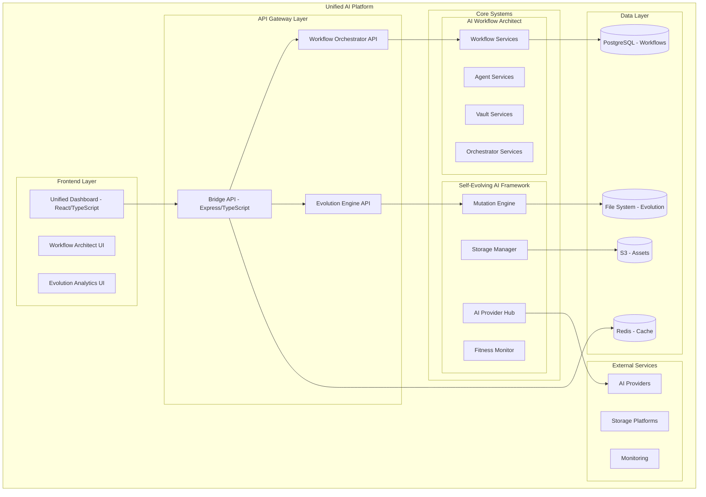

# Design Document

## Overview

The Unified AI Platform integrates the Self-Evolving AI Framework (Python/Flask) with the AI Workflow Architect (React/TypeScript/Express) to create a comprehensive, enterprise-grade AI platform. The integration uses a Bridge API pattern to connect both systems while maintaining their individual strengths.

## Architecture

### High-Level Architecture



### Integration Patterns

1. **Event-Driven Integration**: Both systems communicate through a unified event bus
2. **API Gateway Pattern**: Bridge API provides unified access to both systems
3. **Shared State Management**: Critical state synchronized between systems
4. **Microservices Architecture**: Each system maintains independence while sharing resources

## Components and Interfaces

### Bridge API Service

**Location**: `bridge-api/`
**Technology**: Express.js with TypeScript
**Purpose**: Central integration point between both systems

```typescript
interface BridgeAPI {
  // Unified endpoints
  getSystemStatus(): Promise<UnifiedStatus>
  executeWorkflow(workflow: Workflow): Promise<WorkflowResult>
  proposeMutation(mutation: Mutation): Promise<MutationResult>
  
  // Cross-system operations
  optimizeWorkflowWithEvolution(workflowId: string): Promise<OptimizationResult>
  evolveAgentConfiguration(agentId: string): Promise<EvolutionResult>
  
  // Event management
  subscribeToEvents(eventTypes: string[]): EventStream
  publishCrossSystemEvent(event: CrossSystemEvent): void
}
```

### Unified Dashboard

**Location**: `unified-dashboard/`
**Technology**: React 18 with TypeScript, Tailwind CSS
**Purpose**: Single interface for both systems

```typescript
interface UnifiedDashboard {
  // Combined views
  renderSystemOverview(): JSX.Element
  renderEvolutionMetrics(): JSX.Element
  renderWorkflowStatus(): JSX.Element
  
  // Integrated controls
  renderMutationWorkflowPanel(): JSX.Element
  renderAgentEvolutionPanel(): JSX.Element
  renderUnifiedSettings(): JSX.Element
}
```

### Event Bus Integration

**Location**: `shared/events/`
**Technology**: Redis Pub/Sub with TypeScript interfaces
**Purpose**: Cross-system event communication

```typescript
interface CrossSystemEvent {
  id: string
  type: EventType
  source: 'evolution' | 'workflow'
  target: 'evolution' | 'workflow' | 'both'
  payload: any
  timestamp: Date
  correlationId?: string
}

enum EventType {
  MUTATION_APPLIED = 'mutation_applied',
  WORKFLOW_OPTIMIZED = 'workflow_optimized',
  AGENT_CONFIGURED = 'agent_configured',
  PERFORMANCE_THRESHOLD = 'performance_threshold',
  SYSTEM_HEALING = 'system_healing'
}
```

### Configuration Manager

**Location**: `shared/config/`
**Technology**: TypeScript with JSON Schema validation
**Purpose**: Unified configuration across both systems

```typescript
interface UnifiedConfig {
  evolution: EvolutionConfig
  workflow: WorkflowConfig
  bridge: BridgeConfig
  shared: SharedConfig
}

interface SharedConfig {
  database: DatabaseConfig
  redis: RedisConfig
  aiProviders: AIProviderConfig[]
  security: SecurityConfig
  monitoring: MonitoringConfig
}
```

## Data Models

### Unified System State

```typescript
interface UnifiedSystemState {
  evolution: {
    generation: number
    fitnessScore: number
    activeMutations: Mutation[]
    healingEvents: HealingEvent[]
  }
  workflow: {
    activeAgents: Agent[]
    runningWorkflows: WorkflowExecution[]
    queuedTasks: Task[]
    systemLoad: SystemMetrics
  }
  integration: {
    eventsSynced: number
    lastSyncTime: Date
    crossSystemOptimizations: Optimization[]
  }
}
```

### Cross-System Optimization

```typescript
interface CrossSystemOptimization {
  id: string
  type: 'workflow_evolution' | 'evolution_workflow'
  source: OptimizationSource
  target: OptimizationTarget
  recommendations: Recommendation[]
  status: 'pending' | 'applied' | 'rejected'
  impact: ImpactMetrics
}
```

## Correctness Properties

*A property is a characteristic or behavior that should hold true across all valid executions of a system-essentially, a formal statement about what the system should do. Properties serve as the bridge between human-readable specifications and machine-verifiable correctness guarantees.*

### Property 1: Event Synchronization Consistency
*For any* cross-system event published by one system, the event should be delivered to the target system within the configured timeout period and processed exactly once.
**Validates: Requirements 3.4, 3.5**

### Property 2: Configuration Synchronization
*For any* configuration change applied to the unified platform, both the evolution system and workflow orchestrator should receive consistent configuration updates.
**Validates: Requirements 4.1, 4.2, 4.3**

### Property 3: System State Coherence
*For any* point in time, the unified system state should accurately reflect the current state of both underlying systems without conflicts.
**Validates: Requirements 9.1, 9.3**

### Property 4: Cross-System Optimization Validity
*For any* optimization recommendation generated by cross-system analysis, the recommendation should be applicable to the target system and improve measurable metrics.
**Validates: Requirements 6.1, 6.2, 8.1**

### Property 5: Authentication Consistency
*For any* authenticated user session, the user should have consistent access permissions across both the evolution system and workflow orchestrator.
**Validates: Requirements 7.2, 7.4**

### Property 6: Performance Metric Correlation
*For any* performance optimization applied by the evolution system based on workflow data, the optimization should result in measurable improvement in the targeted metrics.
**Validates: Requirements 8.1, 8.2, 8.4**

### Property 7: Data Synchronization Integrity
*For any* data update in one system, the synchronized data in the other system should maintain referential integrity and consistency.
**Validates: Requirements 9.1, 9.2, 9.3**

### Property 8: Deployment Coordination
*For any* deployment or scaling operation, both systems should be updated in a coordinated manner that maintains system availability.
**Validates: Requirements 10.1, 10.2, 10.3**

### Property 9: Event Ordering Preservation
*For any* sequence of related events across systems, the events should be processed in the correct order to maintain system consistency.
**Validates: Requirements 3.4**

### Property 10: Unified API Response Consistency
*For any* API request to the Bridge API, the response should accurately represent the current state of both underlying systems.
**Validates: Requirements 1.4**

## Error Handling

### Cross-System Error Propagation
- Errors in one system should not cascade to crash the other system
- Error context should be preserved when propagating between systems
- Recovery strategies should coordinate across both systems

### Event Delivery Guarantees
- Failed event deliveries should be retried with exponential backoff
- Dead letter queues should capture undeliverable events
- Event ordering should be maintained during error recovery

### Configuration Validation
- Configuration changes should be validated before applying to either system
- Rollback mechanisms should restore previous configurations on validation failure
- Configuration conflicts should be resolved using defined precedence rules

## Testing Strategy

### Integration Testing
- **End-to-end tests**: Verify complete workflows across both systems
- **Event flow tests**: Validate cross-system event propagation
- **Configuration sync tests**: Ensure configuration changes propagate correctly

### Property-Based Testing
- **Event ordering properties**: Test event sequence preservation under various conditions
- **State synchronization properties**: Verify system state consistency across different scenarios
- **Performance optimization properties**: Validate that optimizations actually improve metrics

### Load Testing
- **Cross-system load**: Test system behavior under high load across both components
- **Event throughput**: Validate event processing capacity under stress
- **Resource scaling**: Test coordinated scaling of both systems

### Chaos Engineering
- **Partial system failures**: Test behavior when one system fails
- **Network partitions**: Validate system behavior during communication failures
- **Data corruption**: Test recovery mechanisms for corrupted shared data

## Implementation Phases

### Phase 1: Bridge API Foundation
1. Create Express.js Bridge API service
2. Implement basic cross-system communication
3. Set up unified configuration management
4. Establish event bus infrastructure

### Phase 2: Dashboard Integration
1. Create unified React dashboard
2. Integrate existing UI components
3. Implement real-time updates
4. Add cross-system controls

### Phase 3: Advanced Integration
1. Implement cross-system optimizations
2. Add autonomous workflow evolution
3. Enhance performance monitoring
4. Complete security integration

### Phase 4: Production Readiness
1. Add comprehensive monitoring
2. Implement deployment automation
3. Complete testing suite
4. Performance optimization