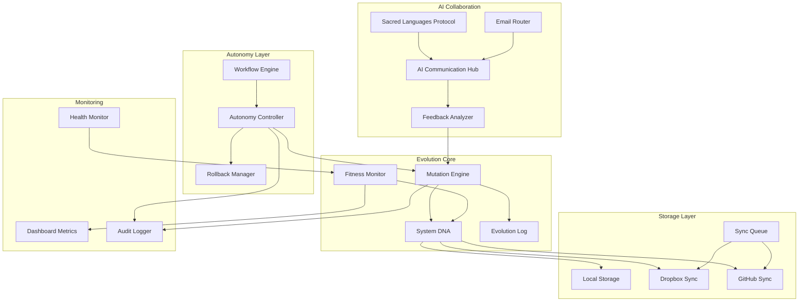

# Design Document: Self-Evolving AI Communication System

## Overview

The Self-Evolving AI Communication System transforms the existing AI communication infrastructure from a static, human-supervised system into an autonomous, self-improving ecosystem. The system extends the Workflow Healer's self-healing capabilities into full evolutionary optimization, enabling AI systems to collaborate, improve, and progress workflows without constant human intervention.

### Key Design Goals
- **Autonomous Workflow Progression**: AI systems execute tasks independently until completion or defined checkpoints
- **Self-Evolution**: System improves based on AI feedback and performance metrics
- **Distributed Storage**: Reliable sync across Dropbox, GitHub, and local storage
- **Safe Mutations**: Risk-based approval with automatic rollback for failures
- **Multi-AI Collaboration**: Formalized interfaces for Lumo, Grok, ChatGPT, Google AI Studio integration

## Architecture



## Components and Interfaces

### 1. Autonomy Controller

Manages autonomous workflow execution with configurable risk thresholds.

```python
class AutonomyController:
    """Controls autonomous AI operations with safety boundaries"""
    
    def __init__(self, config: AutonomyConfig):
        self.risk_threshold = config.risk_threshold  # 0.0-1.0
        self.max_autonomous_mutations = config.max_mutations
        self.checkpoint_interval = config.checkpoint_interval
        self.rollback_manager = RollbackManager()
        
    def execute_workflow(self, workflow: Workflow) -> WorkflowResult:
        """Execute workflow autonomously until completion or checkpoint"""
        pass
    
    def assess_risk(self, mutation: Mutation) -> float:
        """Calculate risk score for proposed mutation (0.0-1.0)"""
        pass
    
    def should_auto_approve(self, mutation: Mutation) -> bool:
        """Determine if mutation can be auto-approved based on risk"""
        pass
    
    def escalate_to_human(self, item: Any, reason: str) -> None:
        """Queue item for human review with context"""
        pass

class AutonomyConfig:
    risk_threshold: float = 0.3  # Auto-approve below this
    max_mutations: int = 10  # Max autonomous mutations per session
    checkpoint_interval: int = 300  # Seconds between checkpoints
    healing_attempts: int = 3  # Self-heal attempts before escalation
```

### 2. System DNA Manager

Manages the genetic configuration of the AI system.

```python
class SystemDNA:
    """Core genetic configuration for the AI system"""
    
    version: str
    birth_timestamp: str
    generation: int
    fitness_score: float
    core_traits: CoreTraits
    mutations: List[MutationRecord]
    
class CoreTraits:
    communication_channels: int
    language_support: int
    ai_participants: List[str]
    evolutionary_features: List[str]
    autonomy_level: float  # 0.0-1.0

class SystemDNAManager:
    """Manages System DNA with safe mutations and rollback"""
    
    def __init__(self, dna_path: Path):
        self.dna_path = dna_path
        self.backup_path = dna_path.with_suffix('.backup.json')
        
    def load(self) -> SystemDNA:
        """Load current DNA configuration"""
        pass
    
    def save(self, dna: SystemDNA) -> bool:
        """Save DNA with automatic backup"""
        pass
    
    def create_snapshot(self) -> str:
        """Create timestamped snapshot for rollback"""
        pass
    
    def rollback(self, snapshot_id: str) -> bool:
        """Restore DNA from snapshot"""
        pass
```

### 3. Mutation Engine

Processes AI feedback and applies system mutations.

```python
class MutationEngine:
    """Engine for AI system evolution and self-modification"""
    
    MUTATION_TYPES = [
        'communication_enhancement',
        'language_expansion',
        'storage_optimization',
        'intelligence_upgrade',
        'protocol_improvement',
        'autonomy_adjustment'
    ]
    
    def __init__(self, dna_manager: SystemDNAManager, autonomy: AutonomyController):
        self.dna_manager = dna_manager
        self.autonomy = autonomy
        self.validator = MutationValidator()
        
    def analyze_feedback(self, feedback: AIFeedback) -> List[Mutation]:
        """Analyze AI feedback to generate mutation proposals"""
        pass
    
    def validate_mutation(self, mutation: Mutation) -> ValidationResult:
        """Validate mutation before application"""
        pass
    
    def apply_mutation(self, mutation: Mutation) -> MutationResult:
        """Apply validated mutation with rollback capability"""
        pass
    
    def calculate_fitness_impact(self, mutation: Mutation) -> float:
        """Estimate fitness score change from mutation"""
        pass

class Mutation:
    type: str
    description: str
    fitness_impact: float
    risk_score: float
    source_ai: Optional[str]
    auto_approved: bool
    rollback_data: Optional[Dict]

class MutationValidator:
    """Validates mutations to prevent system corruption"""
    
    def validate(self, mutation: Mutation, current_dna: SystemDNA) -> ValidationResult:
        """Check mutation safety and compatibility"""
        pass
    
    def check_invariants(self, proposed_dna: SystemDNA) -> bool:
        """Verify DNA invariants are maintained"""
        pass
```

### 4. Storage Synchronization

Manages distributed storage across multiple platforms.

```python
class StorageSync:
    """Multi-platform storage synchronization"""
    
    def __init__(self, config: StorageConfig):
        self.dropbox = DropboxClient(config.dropbox_token)
        self.github = GitHubClient(config.github_token, config.github_repo)
        self.local = LocalStorage(config.local_path)
        self.queue = SyncQueue()
        
    def sync_all(self, data: Dict, filename: str) -> SyncResult:
        """Sync data to all platforms with retry logic"""
        pass
    
    def queue_operation(self, operation: SyncOperation) -> None:
        """Queue operation for retry on failure"""
        pass
    
    def process_queue(self) -> List[SyncResult]:
        """Process queued operations with exponential backoff"""
        pass
    
    def verify_integrity(self, data: Dict, checksum: str) -> bool:
        """Verify data integrity using checksum"""
        pass
    
    def resolve_conflict(self, local: Dict, remote: Dict) -> Dict:
        """Resolve sync conflicts using timestamp-based resolution"""
        pass

class SyncQueue:
    """Queue for failed sync operations with retry logic"""
    
    def add(self, operation: SyncOperation) -> None:
        pass
    
    def get_pending(self) -> List[SyncOperation]:
        pass
    
    def mark_complete(self, operation_id: str) -> None:
        pass
    
    def calculate_backoff(self, attempts: int) -> float:
        """Exponential backoff: 2^attempts seconds, max 300s"""
        return min(2 ** attempts, 300)
```

### 5. Fitness Monitor

Tracks system performance and triggers optimization.

```python
class FitnessMonitor:
    """Monitors system fitness and triggers optimization"""
    
    METRICS = ['success_rate', 'healing_speed', 'cost_efficiency', 'uptime']
    
    def __init__(self, dna_manager: SystemDNAManager):
        self.dna_manager = dna_manager
        self.metrics_history = []
        
    def record_operation(self, operation: Operation, result: OperationResult) -> None:
        """Record operation outcome for fitness calculation"""
        pass
    
    def calculate_fitness(self) -> FitnessScore:
        """Calculate current fitness from all metrics"""
        pass
    
    def detect_degradation(self) -> Optional[DegradationAlert]:
        """Detect performance degradation trends"""
        pass
    
    def suggest_optimization(self, degradation: DegradationAlert) -> Mutation:
        """Generate optimization mutation for degradation"""
        pass
    
    def get_dashboard_data(self) -> DashboardMetrics:
        """Get real-time metrics for Phase 2 dashboard"""
        pass

class FitnessScore:
    overall: float
    success_rate: float
    healing_speed: float  # seconds
    cost_efficiency: float  # operations per dollar
    uptime: float  # percentage
    timestamp: str
```

### 6. Rollback Manager

Handles safe rollback of failed mutations.

```python
class RollbackManager:
    """Manages safe rollback of failed mutations"""
    
    def __init__(self, snapshot_dir: Path):
        self.snapshot_dir = snapshot_dir
        self.max_snapshots = 50
        
    def create_snapshot(self, dna: SystemDNA, label: str) -> Snapshot:
        """Create pre-mutation snapshot"""
        pass
    
    def rollback(self, snapshot: Snapshot) -> RollbackResult:
        """Restore system to snapshot state"""
        pass
    
    def verify_rollback(self, expected: SystemDNA, actual: SystemDNA) -> bool:
        """Verify rollback restored correct state"""
        pass
    
    def cleanup_old_snapshots(self) -> int:
        """Remove snapshots beyond retention limit"""
        pass
```

## Data Models

### System DNA Schema

```json
{
  "version": "1.0.0",
  "birth_timestamp": "2025-12-25T00:00:00Z",
  "generation": 1,
  "fitness_score": 100.0,
  "core_traits": {
    "communication_channels": 8,
    "language_support": 12,
    "ai_participants": ["Lumo", "Grok", "ChatGPT", "GoogleAI"],
    "evolutionary_features": [
      "self_modification",
      "learning_from_responses",
      "adaptive_communication",
      "distributed_storage",
      "version_control",
      "autonomous_workflow"
    ],
    "autonomy_level": 0.7
  },
  "mutations": [],
  "snapshots": []
}
```

### Evolution Log Schema

```json
{
  "system_birth": "2025-12-25T00:00:00Z",
  "evolutionary_events": [],
  "mutations_applied": [
    {
      "id": "mut_001",
      "timestamp": "2025-12-25T01:00:00Z",
      "type": "communication_enhancement",
      "description": "Added real-time sync capability",
      "fitness_impact": 5.0,
      "risk_score": 0.2,
      "auto_approved": true,
      "source_ai": "ChatGPT",
      "rollback_snapshot": "snap_001"
    }
  ],
  "fitness_history": [],
  "ai_contributions": [],
  "storage_sync_history": [],
  "autonomous_actions": []
}
```

### Fitness Metrics Schema

```json
{
  "timestamp": "2025-12-25T12:00:00Z",
  "overall_fitness": 105.0,
  "metrics": {
    "success_rate": 0.95,
    "healing_speed": 2.3,
    "cost_efficiency": 150.0,
    "uptime": 0.999
  },
  "trend": "improving",
  "degradation_alerts": [],
  "optimization_suggestions": []
}
```

## Correctness Properties

*A property is a characteristic or behavior that should hold true across all valid executions of a system—essentially, a formal statement about what the system should do. Properties serve as the bridge between human-readable specifications and machine-verifiable correctness guarantees.*

### Property 1: DNA Initialization Completeness
*For any* system initialization, the resulting System_DNA SHALL contain all required fields: version, birth_timestamp, generation, fitness_score, and core_traits with communication_channels, language_support, and evolutionary_features.
**Validates: Requirements 1.1, 1.5**

### Property 2: Mutation Logging Consistency
*For any* mutation applied to the system, the Evolution_Log SHALL contain a record with the mutation's timestamp, type, description, fitness_impact, and rollback_snapshot within 1 second of application.
**Validates: Requirements 1.2, 3.4**

### Property 3: Fitness Score Tracking
*For any* fitness score change, the delta and contributing factors SHALL be logged, and the new score SHALL equal the previous score plus the sum of all mutation impacts since last calculation.
**Validates: Requirements 1.3, 9.2**

### Property 4: Generation Invariant
*For any* mutation applied, the generation counter SHALL increment by exactly 1, and the mutations array length SHALL increase by exactly 1.
**Validates: Requirements 1.4**

### Property 5: Storage Retry with Backoff
*For any* failed storage operation, the system SHALL retry with exponential backoff (2^n seconds, max 300s) and log each failure with timestamp and error details.
**Validates: Requirements 2.3**

### Property 6: Data Integrity Verification
*For any* data synchronized across platforms, computing the checksum of the synced data SHALL match the original checksum, ensuring no corruption during transfer.
**Validates: Requirements 2.4**

### Property 7: Mutation Validation Safety
*For any* mutation proposal, the Mutation_Engine SHALL validate the mutation before application, and invalid mutations SHALL be rejected without modifying System_DNA.
**Validates: Requirements 3.5**

### Property 8: AI Feedback Parsing
*For any* AI feedback containing improvement-related keywords, the system SHALL generate at least one mutation proposal with type, description, and estimated fitness_impact.
**Validates: Requirements 3.1, 4.1**

### Property 9: Autonomous Action Logging
*For any* autonomous operation (workflow execution, mutation application, self-healing), the system SHALL log the action with timestamp, decision rationale, and outcome before completion.
**Validates: Requirements 8.2**

### Property 10: Risk-Based Approval
*For any* mutation with risk_score below the configured threshold (default 0.3), the system SHALL auto-approve; mutations above threshold SHALL be queued for human review.
**Validates: Requirements 8.4**

### Property 11: Self-Healing Before Escalation
*For any* error during autonomous operation, the system SHALL attempt self-healing (up to configured attempts) before escalating to human review.
**Validates: Requirements 8.3**

### Property 12: Rollback Completeness
*For any* failed mutation, executing rollback SHALL restore System_DNA to the exact state captured in the pre-mutation snapshot, verified by field-by-field comparison.
**Validates: Requirements 8.7**

### Property 13: Comprehensive Audit Logging
*For any* storage operation or autonomous action, an audit log entry SHALL be created with operation type, timestamp, success/failure status, and relevant metadata.
**Validates: Requirements 6.5, 8.2**

### Property 14: Configuration Validation
*For any* configuration change, the system SHALL validate all settings before applying, and invalid configurations SHALL be rejected with specific error messages.
**Validates: Requirements 7.3**

### Property 15: Degradation Detection and Response
*For any* detected performance degradation (fitness drop > 5% over 1 hour), the system SHALL trigger an automatic optimization mutation proposal.
**Validates: Requirements 9.3**

## Error Handling

### Error Categories and Responses

| Error Type | Autonomous Response | Escalation Trigger |
|------------|--------------------|--------------------|
| Storage Sync Failure | Queue + retry with backoff | 5 consecutive failures |
| Invalid Mutation | Reject + log reason | Never (handled automatically) |
| Fitness Degradation | Generate optimization mutation | Degradation > 20% |
| API Authentication | Refresh token + retry | Token refresh fails |
| Rollback Failure | Alert + freeze mutations | Immediate |
| AI Communication Timeout | Retry 3x + queue | All retries fail |

### Self-Healing Strategies

```python
class SelfHealer:
    """Autonomous error recovery strategies"""
    
    STRATEGIES = {
        'storage_failure': ['retry', 'switch_platform', 'queue'],
        'mutation_failure': ['rollback', 'reduce_scope', 'escalate'],
        'communication_failure': ['retry', 'alternate_channel', 'queue'],
        'fitness_degradation': ['optimize', 'rollback_recent', 'escalate']
    }
    
    def heal(self, error: SystemError) -> HealingResult:
        """Attempt self-healing based on error type"""
        strategies = self.STRATEGIES.get(error.type, ['escalate'])
        for strategy in strategies:
            result = self.apply_strategy(strategy, error)
            if result.success:
                return result
        return HealingResult(success=False, escalate=True)
```

## Testing Strategy

### Unit Tests
- Test individual component methods in isolation
- Mock external services (Dropbox, GitHub APIs)
- Verify error handling and edge cases
- Focus on mutation validation and rollback logic

### Property-Based Tests
Property-based testing validates universal properties across many generated inputs. Each property test runs minimum 100 iterations.

**Testing Framework**: `hypothesis` (Python)

```python
from hypothesis import given, strategies as st

# Property 1: DNA Initialization Completeness
@given(st.builds(SystemDNA))
def test_dna_initialization_completeness(dna):
    """Feature: self-evolving-ai-system, Property 1: DNA Initialization"""
    assert dna.version is not None
    assert dna.birth_timestamp is not None
    assert dna.generation >= 1
    assert dna.fitness_score >= 0
    assert dna.core_traits.communication_channels >= 0
    assert dna.core_traits.language_support >= 0
    assert len(dna.core_traits.evolutionary_features) >= 0

# Property 4: Generation Invariant
@given(st.builds(SystemDNA), st.builds(Mutation))
def test_generation_invariant(dna, mutation):
    """Feature: self-evolving-ai-system, Property 4: Generation Invariant"""
    original_gen = dna.generation
    original_mutations = len(dna.mutations)
    
    engine = MutationEngine(dna)
    engine.apply_mutation(mutation)
    
    assert dna.generation == original_gen + 1
    assert len(dna.mutations) == original_mutations + 1

# Property 12: Rollback Completeness
@given(st.builds(SystemDNA), st.builds(Mutation))
def test_rollback_completeness(dna, mutation):
    """Feature: self-evolving-ai-system, Property 12: Rollback Completeness"""
    original_state = dna.copy()
    
    manager = RollbackManager()
    snapshot = manager.create_snapshot(dna, "pre-mutation")
    
    engine = MutationEngine(dna)
    engine.apply_mutation(mutation)
    
    manager.rollback(snapshot)
    
    assert dna == original_state
```

### Integration Tests
- Test end-to-end workflow execution
- Verify multi-platform storage sync
- Test AI communication round-trips
- Validate Sacred Languages protocol integration

### Test Coverage Requirements
- Unit tests: 80% code coverage minimum
- Property tests: All 15 correctness properties
- Integration tests: Critical paths (storage sync, mutation apply, rollback)