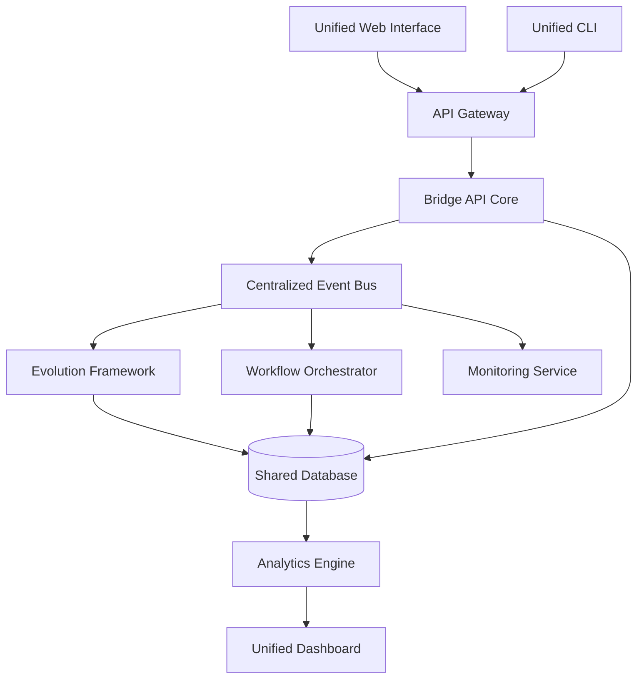

# Design Document: Unified Application Integration

## Overview

This design addresses the critical need to transform multiple partially-working applications (Bridge API, Evolution Framework, Workflow Orchestrator) into a single, cohesive unified application. The current architecture suffers from fragmented integration, inconsistent contracts, and duplicated functionality across TypeScript and Python components.

## Architecture

### Current State Problems
- **Fragmented Integration**: Bridge API, Evolution Framework, and Workflow Orchestrator operate as separate applications with loose coupling
- **Inconsistent Contracts**: Each component defines its own event schemas, data models, and communication protocols
- **Configuration Issues**: Jest TypeScript configuration prevents proper testing of integration points
- **Duplicated Logic**: Similar functionality exists across multiple codebases without shared abstractions

### Target Unified Architecture



## Service Responsibilities

| Service | Primary Responsibility | What It Owns | What It Doesn't Own |
|---------|----------------------|--------------|-------------------|
| **API Gateway** | Request/response, auth, routing | HTTP endpoints, authentication, rate limiting, request validation | Business logic, data persistence, event processing |
| **Event Bus** | Transport, ordering, retries | Event delivery, ordering guarantees, retry policies, dead letter queues | Event content validation, business rules |
| **Workflow Orchestrator** | Long-running orchestration | Workflow definitions, task dependencies, execution state | Individual task implementation, service-specific logic |
| **Evolution Framework** | AI/evolution logic | Evolution algorithms, model training, AI decision making | Task routing, event transport, data persistence |
| **Bridge API Core** | Service coordination | Inter-service communication, protocol translation | Service-specific business logic |
| **Task Manager** | Task lifecycle | Task state, unique IDs, correlation tracking | Task execution, workflow orchestration |
| **Configuration Manager** | Environment config | Configuration loading, validation, secret management | Service-specific configuration logic |

## Components and Interfaces

### 1. Unified API Gateway
**Purpose**: Single entry point for all client interactions
**Technology**: Express.js with TypeScript
**Responsibilities**:
- Route requests to appropriate services
- Handle authentication and authorization
- Implement rate limiting and request validation
- Provide unified error handling

```typescript
interface UnifiedAPIGateway {
  // Core routing
  routeToEvolution(request: EvolutionRequest): Promise<EvolutionResponse>
  routeToWorkflow(request: WorkflowRequest): Promise<WorkflowResponse>
  routeToBridge(request: BridgeRequest): Promise<BridgeResponse>
  
  // Cross-cutting concerns
  authenticate(token: string): Promise<User>
  validateRequest(request: any, schema: Schema): ValidationResult
  handleError(error: Error): ErrorResponse
}
```

### 2. Centralized Event Bus
**Purpose**: Unified communication layer between all components
**Technology**: TypeScript with Redis backing
**Responsibilities**:
- Event routing and delivery
- Event persistence and replay
- Dead letter queue handling
- Event schema validation

```typescript
interface CentralizedEventBus {
  // Event publishing
  publish<T>(event: UnifiedEvent<T>): Promise<void>
  publishBatch<T>(events: UnifiedEvent<T>[]): Promise<void>
  
  // Event subscription
  subscribe<T>(eventType: string, handler: EventHandler<T>): Subscription
  unsubscribe(subscription: Subscription): void
  
  // Event querying
  getEventHistory(filters: EventFilters): Promise<UnifiedEvent[]>
  replayEvents(fromTimestamp: Date, toTimestamp: Date): Promise<void>
}
```

### 3. Shared Type System
**Purpose**: Single source of truth for all data models and contracts
**Technology**: TypeScript with Python type generation
**Location**: `shared/types/` directory

```typescript
// Core unified types
interface UnifiedTask {
  id: TaskId
  type: TaskType
  status: TaskStatus
  payload: TaskPayload
  metadata: TaskMetadata
  createdAt: Date
  updatedAt: Date
}

interface UnifiedEvent<T = any> {
  id: EventId
  type: EventType
  source: ServiceName
  target?: ServiceName
  payload: T
  timestamp: Date
  correlationId: string
}

interface UnifiedResponse<T = any> {
  success: boolean
  data?: T
  error?: UnifiedError
  metadata: ResponseMetadata
}
```

### 4. Evolution Framework Adapter
**Purpose**: Bridge between Python Evolution Framework and TypeScript ecosystem
**Technology**: FastAPI with TypeScript client generation
**Responsibilities**:
- Translate TypeScript events to Python objects
- Handle Evolution Framework lifecycle
- Provide health monitoring and metrics

```typescript
interface EvolutionAdapter {
  // Task management
  submitTask(task: UnifiedTask): Promise<TaskSubmissionResult>
  getTaskStatus(taskId: TaskId): Promise<TaskStatus>
  cancelTask(taskId: TaskId): Promise<CancellationResult>
  
  // Evolution operations
  triggerEvolution(config: EvolutionConfig): Promise<EvolutionResult>
  getEvolutionHistory(): Promise<EvolutionEvent[]>
  
  // Health and monitoring
  getHealth(): Promise<HealthStatus>
  getMetrics(): Promise<EvolutionMetrics>
}
```

### 5. Workflow Orchestrator Integration
**Purpose**: Unified workflow management across all components
**Technology**: TypeScript with state machine implementation
**Responsibilities**:
- Coordinate multi-step processes
- Handle workflow state persistence
- Provide workflow visualization and monitoring

```typescript
interface WorkflowOrchestrator {
  // Workflow definition
  defineWorkflow(definition: WorkflowDefinition): Promise<WorkflowId>
  updateWorkflow(id: WorkflowId, definition: WorkflowDefinition): Promise<void>
  
  // Workflow execution
  startWorkflow(id: WorkflowId, input: WorkflowInput): Promise<WorkflowExecution>
  pauseWorkflow(executionId: ExecutionId): Promise<void>
  resumeWorkflow(executionId: ExecutionId): Promise<void>
  
  // Workflow monitoring
  getWorkflowStatus(executionId: ExecutionId): Promise<WorkflowStatus>
  getWorkflowHistory(executionId: ExecutionId): Promise<WorkflowEvent[]>
}
```

## Data Models

### Unified Task Model
```typescript
interface UnifiedTask {
  // Identity
  id: TaskId
  correlationId: string
  parentTaskId?: TaskId
  
  // Classification
  type: TaskType // 'evolution' | 'workflow' | 'bridge' | 'hybrid'
  category: TaskCategory
  priority: TaskPriority
  
  // State
  status: TaskStatus // 'pending' | 'running' | 'completed' | 'failed' | 'cancelled'
  progress: TaskProgress
  
  // Content
  payload: TaskPayload
  result?: TaskResult
  error?: TaskError
  
  // Metadata
  createdBy: UserId
  assignedTo?: ServiceName
  tags: string[]
  
  // Timestamps
  createdAt: Date
  startedAt?: Date
  completedAt?: Date
  updatedAt: Date
  
  // Configuration
  timeout?: number
  retryPolicy?: RetryPolicy
  dependencies: TaskId[]
}
```

### Unified Event Schema
```typescript
interface UnifiedEvent<T = any> {
  // Identity
  id: EventId
  correlationId: string
  causationId?: EventId
  
  // Routing
  type: EventType
  source: ServiceName
  target?: ServiceName
  
  // Content
  payload: T
  version: number
  
  // Metadata
  timestamp: Date
  userId?: UserId
  sessionId?: SessionId
  
  // Processing
  processed: boolean
  retryCount: number
  maxRetries: number
}
```

### Configuration Management
```typescript
interface UnifiedConfig {
  // Service configuration
  services: {
    bridge: BridgeConfig
    evolution: EvolutionConfig
    workflow: WorkflowConfig
    eventBus: EventBusConfig
  }
  
  // Database configuration
  database: DatabaseConfig
  
  // Security configuration
  security: SecurityConfig
  
  // Monitoring configuration
  monitoring: MonitoringConfig
  
  // Feature flags
  features: FeatureFlags
}
```

### Verification Strategy

#### Jest Test Suites
- **Unit Tests**: `src/tests/unit/` - Individual component testing
- **Integration Tests**: `src/tests/integration/` - Cross-service testing  
- **Property Tests**: `src/tests/properties/` - Property-based testing with fast-check
- **End-to-End Tests**: `src/tests/e2e/` - Complete workflow testing

#### Runtime Monitoring
- **Event Bus Metrics**: Message throughput, delivery latency, ordering violations
- **Service Health Checks**: Response time monitoring, error rate tracking
- **Data Consistency Checks**: Periodic validation of cross-service data integrity
- **Performance Alerts**: Automated alerts for SLA violations

## Testing Strategy

### Jest TypeScript Configuration Fix
```javascript
// jest.config.js
module.exports = {
  preset: 'ts-jest',
  testEnvironment: 'node',
  roots: ['<rootDir>/src'],
  testMatch: [
    '**/__tests__/**/*.ts',
    '**/?(*.)+(spec|test).ts'
  ],
  transform: {
    '^.+\\.ts$': 'ts-jest'
  },
  collectCoverageFrom: [
    'src/**/*.ts',
    '!src/**/*.d.ts',
    '!src/tests/**/*'
  ],
  setupFilesAfterEnv: ['<rootDir>/src/tests/setup.ts'],
  moduleNameMapping: {
    '^@/(.*)$': '<rootDir>/src/$1',
    '^@shared/(.*)$': '<rootDir>/shared/$1'
  }
}
```

### Test Setup Configuration
```typescript
// src/tests/setup.ts
import { UnifiedConfig } from '@shared/types'

// Global test configuration
global.testConfig = {
  database: {
    url: 'sqlite::memory:',
    logging: false
  },
  eventBus: {
    provider: 'memory',
    persistence: false
  }
}

// Mock external services
jest.mock('../services/evolutionAdapter')
jest.mock('../services/workflowOrchestrator')

// Setup test database
beforeAll(async () => {
  // Initialize test database
})

afterAll(async () => {
  // Cleanup test resources
})
```

### Integration Test Strategy
```typescript
describe('Unified Application Integration', () => {
  describe('End-to-End Task Flow', () => {
    it('should process evolution task through unified pipeline', async () => {
      // Arrange
      const task = createEvolutionTask()
      
      // Act
      const result = await unifiedApp.processTask(task)
      
      // Assert
      expect(result.success).toBe(true)
      expect(result.data.status).toBe('completed')
      
      // Verify event flow
      const events = await eventBus.getEventHistory({
        correlationId: task.correlationId
      })
      expect(events).toHaveLength(4) // submitted, started, processed, completed
    })
    
    it('should handle cross-service workflow coordination', async () => {
      // Test workflow that spans Evolution Framework and Bridge API
    })
    
    it('should maintain data consistency across service boundaries', async () => {
      // Test transaction-like behavior across services
    })
  })
})
```

### Property-Based Testing
```typescript
// Property tests for unified contracts
describe('Unified Event Contract Properties', () => {
  it('should maintain event ordering guarantees', () => {
    fc.assert(fc.property(
      fc.array(eventGenerator()),
      (events) => {
        const processed = eventBus.processEvents(events)
        return isEventOrderPreserved(events, processed)
      }
    ))
  })
  
  it('should ensure task state transitions are valid', () => {
    fc.assert(fc.property(
      taskGenerator(),
      fc.array(taskEventGenerator()),
      (initialTask, events) => {
        const finalTask = applyEvents(initialTask, events)
        return isValidTaskState(finalTask)
      }
    ))
  })
})
```

## Error Handling

### Unified Error Model
```typescript
interface UnifiedError {
  // Identity
  id: ErrorId
  correlationId: string
  
  // Classification
  type: ErrorType // 'validation' | 'business' | 'system' | 'integration'
  code: ErrorCode
  severity: ErrorSeverity
  
  // Content
  message: string
  details: ErrorDetails
  context: ErrorContext
  
  // Source tracking
  source: ServiceName
  stackTrace?: string
  
  // Recovery
  retryable: boolean
  suggestedAction?: string
  
  // Metadata
  timestamp: Date
  userId?: UserId
}
```

### Error Handling Strategy
```typescript
class UnifiedErrorHandler {
  async handleError(error: UnifiedError): Promise<ErrorHandlingResult> {
    // Log error with correlation tracking
    await this.logger.logError(error)
    
    // Determine recovery strategy
    const strategy = this.getRecoveryStrategy(error)
    
    // Execute recovery if possible
    if (strategy.canRecover) {
      return await this.executeRecovery(error, strategy)
    }
    
    // Escalate if necessary
    if (error.severity === 'critical') {
      await this.escalateError(error)
    }
    
    return { handled: true, recovered: false }
  }
  
  private getRecoveryStrategy(error: UnifiedError): RecoveryStrategy {
    switch (error.type) {
      case 'integration':
        return new ServiceRetryStrategy()
      case 'validation':
        return new ValidationErrorStrategy()
      case 'business':
        return new BusinessLogicErrorStrategy()
      default:
        return new DefaultErrorStrategy()
    }
  }
}
```

## Security Considerations

### Authentication and Authorization
```typescript
interface UnifiedSecurity {
  // Authentication
  authenticateUser(credentials: UserCredentials): Promise<AuthResult>
  authenticateService(serviceToken: ServiceToken): Promise<ServiceAuthResult>
  
  // Authorization
  authorizeUserAction(user: User, action: Action, resource: Resource): Promise<boolean>
  authorizeServiceAction(service: Service, action: Action): Promise<boolean>
  
  // Token management
  generateUserToken(user: User): Promise<UserToken>
  generateServiceToken(service: Service): Promise<ServiceToken>
  validateToken(token: Token): Promise<TokenValidationResult>
  
  // Audit
  logSecurityEvent(event: SecurityEvent): Promise<void>
}
```

### Data Protection
- All inter-service communication encrypted with TLS 1.3
- Sensitive data encrypted at rest using AES-256-GCM
- API keys and secrets managed through centralized vault
- Regular security audits and vulnerability scanning

## Deployment Strategy

### Development Environment
```yaml
# docker-compose.dev.yml
version: '3.8'
services:
  unified-app:
    build: .
    ports:
      - "3000:3000"
    environment:
      - NODE_ENV=development
      - DATABASE_URL=postgresql://localhost:5432/unified_dev
    volumes:
      - ./src:/app/src
      - ./shared:/app/shared
    
  evolution-framework:
    build: ./evolution
    ports:
      - "8000:8000"
    environment:
      - PYTHON_ENV=development
    
  redis:
    image: redis:alpine
    ports:
      - "6379:6379"
    
  postgres:
    image: postgres:15
    environment:
      - POSTGRES_DB=unified_dev
      - POSTGRES_USER=dev
      - POSTGRES_PASSWORD=dev
    ports:
      - "5432:5432"
```

### Production Deployment
- Container orchestration with Kubernetes
- Auto-scaling based on load metrics
- Blue-green deployment strategy
- Comprehensive monitoring and alerting
- Backup and disaster recovery procedures

## Migration Plan

### Phase 1: Foundation (Week 1-2)
1. Fix Jest TypeScript configuration
2. Create shared types package
3. Implement centralized event bus
4. Set up unified database schema

### Phase 2: Service Integration (Week 3-4)
1. Implement Evolution Framework adapter
2. Integrate Workflow Orchestrator
3. Create unified API gateway
4. Establish error handling patterns

### Phase 3: Testing and Validation (Week 5-6)
1. Implement comprehensive test suite
2. Add integration tests
3. Performance testing and optimization
4. Security audit and hardening

### Phase 4: Deployment and Monitoring (Week 7-8)
1. Set up production deployment pipeline
2. Implement monitoring and alerting
3. Create operational runbooks
4. User acceptance testing

## Design Trade-offs & Risks

### Architectural Decisions

**Single Centralized Event Bus vs Partitioned Buses**
- **Decision**: Single Redis-based event bus for initial implementation
- **Risk**: Potential bottleneck under high load
- **Mitigation**: Plan for horizontal partitioning by event type or service, implement monitoring for throughput metrics

**Shared Database vs Fully Separated Data Stores**
- **Decision**: Shared PostgreSQL database with service-specific schemas
- **Risk**: Coupling between services through shared data model
- **Mitigation**: Use database views and stored procedures to enforce boundaries, plan migration to service-specific databases

**Eventual Consistency Across Services**
- **Decision**: Accept eventual consistency for non-critical operations
- **Risk**: Temporary data inconsistencies during high load or failures
- **Mitigation**: Implement consistency monitoring, provide manual reconciliation tools, use saga pattern for critical workflows

**TypeScript/Python Polyglot Architecture**
- **Decision**: Keep Evolution Framework in Python, other services in TypeScript
- **Risk**: Type safety gaps at service boundaries, deployment complexity
- **Mitigation**: Automated type generation, comprehensive integration tests, containerized deployment

### Known Limitations

- **Single Point of Failure**: Event Bus and shared database are potential SPOFs
- **Performance**: Initial implementation prioritizes correctness over performance
- **Scalability**: Vertical scaling approach may require horizontal scaling later
- **Complexity**: Microservices architecture increases operational overhead

### Monitoring Strategy

- **Event Bus Metrics**: Message throughput, delivery latency, retry rates
- **Service Health**: Response times, error rates, resource utilization  
- **Data Consistency**: Cross-service data validation, reconciliation alerts
- **Integration Points**: Success rates for inter-service communication

## Correctness Properties

*A property is a characteristic or behavior that should hold true across all valid executions of a system-essentially, a formal statement about what the system should do. Properties serve as the bridge between human-readable specifications and machine-verifiable correctness guarantees.*

### Property 1: TypeScript Test Parsing
*For any* valid TypeScript test file with proper syntax, the test runner should parse it without throwing "Missing semicolon" errors
**Validates: Requirements 1.2**

### Property 2: Test File Pattern Recognition
*For any* file with .test.ts or .spec.ts extension in the test directories, the test runner should discover and include it in the test suite
**Validates: Requirements 1.3**

### Property 3: Path Alias Resolution
*For any* import statement using configured path aliases in test files, the test runner should resolve the import correctly without module resolution errors
**Validates: Requirements 1.4**

### Property 4: Event Bus Delivery Guarantee
*For any* published event and any set of registered subscribers, all subscribers should receive the event exactly once
**Validates: Requirements 2.1**

### Property 5: Event Schema Validation
*For any* event that violates the unified event schema, the event bus should reject it and provide validation error details
**Validates: Requirements 2.2**

### Property 6: Event Retry Policy Compliance
*For any* failed event delivery, the event bus should retry according to the configured retry policy until success or max retries reached
**Validates: Requirements 2.3**

### Property 7: Event Replay Consistency
*For any* sequence of events, replaying them in the same order should produce the same final system state
**Validates: Requirements 2.4**

### Property 8: Event Ordering Preservation
*For any* sequence of events published to the same topic, the event bus should deliver them to subscribers in the same order
**Validates: Requirements 2.5**

### Property 9: Type System Round Trip
*For any* TypeScript type definition, converting it to Python and back should preserve the essential structure and constraints
**Validates: Requirements 3.2**

### Property 10: Runtime Type Validation
*For any* data object and any shared type schema, runtime validation should correctly accept valid data and reject invalid data with descriptive errors
**Validates: Requirements 3.4**

### Property 11: Evolution Task Translation
*For any* valid TypeScript evolution request, the Evolution Adapter should successfully translate it to Python format and back without data loss
**Validates: Requirements 4.1**

### Property 12: Evolution Completion Events
*For any* evolution process that completes (successfully or with failure), the Evolution Adapter should publish a completion event to the Event Bus
**Validates: Requirements 4.2**

### Property 13: Evolution Status Consistency
*For any* evolution process, the status returned by the Evolution Adapter should accurately reflect the actual state of the process
**Validates: Requirements 4.3**

### Property 14: Evolution Error Handling
*For any* evolution process that fails, the Evolution Adapter should handle the failure gracefully without crashing and provide detailed error information
**Validates: Requirements 4.4**

### Property 15: Evolution Metrics Availability
*For any* request for evolution health and performance data, the Evolution Adapter should provide current metrics without errors
**Validates: Requirements 4.5**

### Property 16: Workflow Dependency Resolution
*For any* workflow with task dependencies, the Workflow Orchestrator should execute tasks in an order that respects all dependency constraints
**Validates: Requirements 5.2**

### Property 17: Workflow State Persistence and Events
*For any* workflow state change, the Workflow Orchestrator should both persist the new state and publish a state change event
**Validates: Requirements 5.3**

### Property 18: Workflow Rollback Capability
*For any* workflow that fails, the Workflow Orchestrator should be able to rollback completed tasks or provide recovery mechanisms
**Validates: Requirements 5.4**

### Property 19: Workflow Monitoring Consistency
*For any* workflow execution, the monitoring data should accurately reflect the current state and history of the workflow
**Validates: Requirements 5.5**

### Property 20: API Gateway Routing
*For any* client request, the API Gateway should route it to the correct backend service based on the configured routing rules
**Validates: Requirements 6.1**

### Property 21: Authentication Validation
*For any* authentication credentials, the API Gateway should correctly validate them and authorize or deny access based on credential validity
**Validates: Requirements 6.2**

### Property 22: Standardized Error Responses
*For any* malformed request, the API Gateway should return an error response that conforms to the standardized error format
**Validates: Requirements 6.3**

### Property 23: Service Failure Resilience
*For any* backend service failure, the API Gateway should handle it gracefully without crashing and provide appropriate error responses
**Validates: Requirements 6.4**

### Property 24: Rate Limiting Enforcement
*For any* sequence of requests that exceeds configured rate limits, the API Gateway should enforce the limits and provide appropriate feedback
**Validates: Requirements 6.5**

### Property 25: Task ID Uniqueness
*For any* set of tasks created by the Task Manager, all task identifiers should be unique and correlation relationships should be preserved
**Validates: Requirements 7.1**

### Property 26: Task Status Consistency
*For any* task status change, all services should observe the same status when querying the Task Manager
**Validates: Requirements 7.2**

### Property 27: Task Dependency Ordering
*For any* task graph with dependencies, the Task Manager should ensure execution order respects all dependency constraints
**Validates: Requirements 7.3**

### Property 28: Task Retry Mechanism
*For any* failed task, the Task Manager should retry according to the configured retry policy
**Validates: Requirements 7.4**

### Property 29: Task Query Correctness
*For any* task query with specific criteria, the Task Manager should return only tasks that match all specified criteria
**Validates: Requirements 7.5**

### Property 30: Error Logging with Correlation
*For any* error that occurs in any service, the Error Handler should log it with proper correlation tracking information
**Validates: Requirements 8.1**

### Property 31: Automatic Error Recovery
*For any* recoverable error, the Error Handler should attempt recovery using the appropriate strategy for that error type
**Validates: Requirements 8.2**

### Property 32: Critical Error Escalation
*For any* error classified as critical, the Error Handler should trigger escalation and appropriate alerts
**Validates: Requirements 8.3**

### Property 33: Error Context Completeness
*For any* error, the Error Handler should provide sufficient debugging information including context and stack traces
**Validates: Requirements 8.5**

### Property 34: Environment-Specific Configuration
*For any* deployment environment, the Configuration Manager should load the correct environment-specific configuration settings
**Validates: Requirements 9.1**

### Property 35: Configuration Change Validation
*For any* configuration change, the Configuration Manager should validate it and notify all affected services
**Validates: Requirements 9.2**

### Property 36: Secure Secret Management
*For any* secret access request, the Configuration Manager should provide the secret securely and handle rotation correctly
**Validates: Requirements 9.3**

### Property 37: Configuration Completeness
*For any* service startup, the Configuration Manager should provide all necessary configuration data required by that service
**Validates: Requirements 9.4**

### Property 38: Invalid Configuration Prevention
*For any* invalid configuration, the Configuration Manager should prevent service startup and provide clear error messages
**Validates: Requirements 9.5**

### Property 39: Health Metrics Collection
*For any* running service, the Monitoring System should successfully collect health metrics from that service
**Validates: Requirements 11.1**

### Property 40: Performance Degradation Detection
*For any* performance degradation that exceeds configured thresholds, the Monitoring System should detect it and trigger alerts
**Validates: Requirements 11.2**

### Property 41: End-to-End Request Tracing
*For any* request processed by the system, the Monitoring System should provide complete trace information across all services
**Validates: Requirements 11.3**

### Property 42: Data Consistency Maintenance
*For any* data modification in any service, the Data Manager should ensure all related data remains consistent
**Validates: Requirements 12.1**

### Property 43: Distributed Transaction Atomicity
*For any* transaction that spans multiple services, the Data Manager should ensure it either fully succeeds or fully fails
**Validates: Requirements 12.2**

### Property 44: Data Conflict Resolution
*For any* data conflict, the Data Manager should apply conflict resolution mechanisms and produce a consistent result
**Validates: Requirements 12.3**

### Property 45: Data Migration Integrity
*For any* data migration operation, the Data Manager should preserve data integrity and provide validation of the migration results
**Validates: Requirements 12.4**

### Property 46: Unified Query Interface Consistency
*For any* query operation, the Data Manager should provide consistent query interfaces across all services
**Validates: Requirements 12.5**

## Success Metrics

### Technical Metrics
- **Test Coverage**: >90% code coverage across all components
- **Integration Success Rate**: >99.9% successful cross-service communications
- **Response Time**: <200ms average API response time
- **Error Rate**: <0.1% unhandled errors

### Business Metrics
- **Development Velocity**: 50% reduction in feature development time
- **Operational Overhead**: 60% reduction in deployment complexity
- **System Reliability**: 99.9% uptime SLA
- **Developer Experience**: Unified development workflow across all components

This design provides a comprehensive roadmap for transforming the fragmented application landscape into a single, cohesive unified application that delivers on the original vision of integrated AI-powered automation.